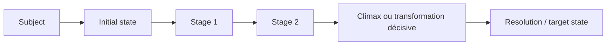
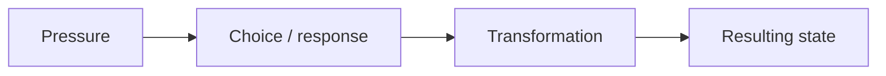

# Arcs narratifs généralisés

Le domaine `narrativeArc` introduit une primitive réutilisable par AutoFiction pour suivre la transformation d'un sujet du début au dénouement sans imposer qu'il s'agisse d'un personnage humain.

## Pourquoi `NarrativeArc` et non `CharacterArc`

Un roman complexe peut attribuer une évolution narrative à :

- un protagoniste ou un personnage secondaire ;
- une relation ;
- un groupe ;
- une institution ;
- un lieu ;
- un milieu naturel ;
- un objet ou système dont la fonction change au cours du récit ;
- un narrateur.

Le schéma sépare donc le **sujet de l'arc** de ses dimensions. La psychologie est facultative ; l'état et la transformation sont universels.



## Structures supportées

`framework` peut valoir :

- `custom` ;
- `freytag` ;
- `three-act` ;
- `hero-journey` ;
- `save-the-cat` ;
- `todorov` ;
- `propp`.

Les templates sont disponibles via `getNarrativeFrameworkTemplate()`. Ils servent de grilles de planification et d'audit, jamais de contrats rigides. `evaluateNarrativeArc()` signale donc un beat théorique absent avec un `warning`, pas avec une erreur bloquante.

## Ordre causal et ordre de narration

`NarrativeArcStage.order` représente l'ordre de transformation de l'arc.

`NarrativeArcStage.presentation` décrit la manière dont cette étape est racontée :

```ts
{
  focalization: "internal",
  focalizerId: "character-jonas",
  temporalRelation: "analepsis",
  duration: "scene"
}
```

Un flashback peut donc apparaître tard dans le manuscrit tout en représentant une cause antérieure dans l'arc. Cette séparation empêche de confondre chronologie diégétique et ordre de révélation.

## Exemple : personnage principal

```ts
const arc = createNarrativeArc({
  projectId: project.id,
  title: "Mara choisit la vérité contre le village",
  subject: { id: mara.id, kind: "character", label: "Mara" },
  roles: ["protagonist", "witness"],
  framework: "three-act",
  trajectory: "positive",
  narrativeFunction: "Porter le conflit entre vérité et appartenance.",
  psychologicalFunction: "Transformer la loyauté défensive en responsabilité.",
  initialState: {
    summary: "Mara protège le silence collectif.",
    dimensions: {
      belief: "Le village doit être protégé à tout prix.",
      fear: "Être rejetée par les siens."
    }
  }
});
```

## Exemple : milieu naturel

```ts
const marshArc = createNarrativeArc({
  projectId: project.id,
  title: "La tourbière reprend le village",
  subject: {
    id: "environment-marsh",
    kind: "environment",
    label: "La tourbière"
  },
  roles: ["setting-force", "antagonist", "symbolic"],
  framework: "freytag",
  trajectory: "ambiguous",
  narrativeFunction: "Transformer le paysage en contrainte active.",
  initialState: {
    summary: "La tourbière paraît contenue.",
    dimensions: {
      waterLevel: "bas",
      accessibility: "routes praticables",
      perceivedAgency: "décor"
    }
  }
});
```

Aucune `psychologicalFunction` n'est nécessaire.

## Cycle d'une étape

Une étape possède :

- sa fonction narrative ;
- la pression exercée ;
- la décision ou réponse du sujet ;
- la transformation ;
- l'état résultant ;
- la logique d'apparition du sujet ;
- les scènes qui matérialisent l'étape ;
- son mode de présentation ;
- son statut (`planned`, `observed`, `committed`, `superseded`).



## Fonctions publiques

### `createNarrativeArc(input)`

Crée l'arc avec son état initial, son rôle et sa structure éventuelle.

### `addNarrativeArcStage(arc, input)`

Ajoute une étape. Aucun réordonnancement implicite n'est effectué et deux étapes ne peuvent partager le même `order`.

### `updateNarrativeArcStage(arc, stageId, patch)`

Modifie une étape sans changer son identifiant ni son ordre. Un arc ou une étape `authorLocked` refuse la modification.

### `deriveNarrativeArcProgress(arc)`

Projection déterministe du nombre d'étapes committed et de l'étape suivante. Ce n'est pas un score littéraire.

### `evaluateNarrativeArc(arc)`

Audit structurel read-only :

- arc vide ;
- climax explicite absent ;
- beat du framework absent ou hors ordre ;
- étape observée sans scène source ;
- arc déclaré résolu sans étape finale committed ;
- psychologie appliquée à un sujet non humain, signalée seulement comme lecture anthropomorphique potentielle.

## Invariants

1. Un arc n'écrit jamais le manuscrit.
2. Une grille narrative ne devient jamais une vérité canonique.
3. Une transformation observée doit pouvoir pointer vers la ou les scènes qui la rendent visible.
4. Le statut `committed` sera à terme alimenté uniquement après validation de la scène par le pipeline AutoFiction.
5. Les locks auteur prévalent sur l'automatisation.
6. La chronologie de l'arc et l'ordre de narration restent indépendants.

## Intégration AutoFiction suivante

La prochaine couche doit relier `NarrativeArcStage.sceneRefs` aux futurs `SceneContract` et `StoryEvent` : une scène acceptée pourra faire progresser plusieurs arcs (protagoniste, personnage secondaire, relation, village, milieu naturel) dans une même transaction, sans que le writer modifie directement les arcs.
